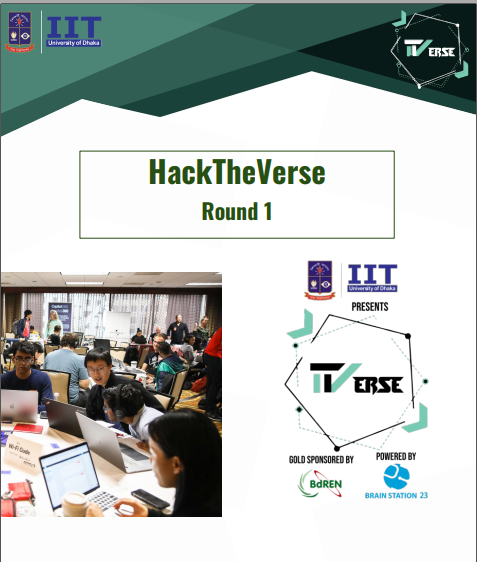

<h1>HackTheVerse Round 1(Health Domain)</h1>


<h2> Hackathon hosted by IIT , University Of Dhaka </h2>

<p>This hackathon aims to Provide communication/analysis generated from data streams in medical systems/sensors 
<p>
<h2>System Architecture Diagrams </h2>
<h5>Activity Diagram</h5>


<h5>Data Flow Diagram</h5>


<h5>Use Case Diagram</h5>


To be very brief , our system is an automation of conducting medical activities online.Like a patient can directly communicate with Doctors/Nurses and take their guidances and keep himself monitored for any amount of time he wants.In case any emergency takes place , doctors/nurses will be notified for further action.Health datas have been streamed using ```Apache Kafka```.

<b>Specifications</b>
```
Framework: Django 2.0
Database: Sqlite3
Streaming Server : Apache kafka
```
<b>Run this project</b>
1. Download or clone this repository in your local system<br>
2. In command prompt or terminal, type and run "pip install -r requirements.txt" <br>
3. Install Apache Kafka and start zookeeper server and kafka server
    ```
    .\bin\windows\zookeeper-server-start.bat .\config\zookeeper.properties
    .\bin\windows\kafka-server-start.bat .\config\server.properties
    ```
    Then run two python scripts
    ```
    python producer.py
    python beeper.py
    ```
4. After installing necessary libraries, run ```python manage.py runserver``` and go to the URl ```http://127.0.0.1:8000/fetchdata/``` to start the consumer thread of kafka
<b>If you want administrator access</b>
```
user name: Toddlers<br>
password: srelddot17<br>
```
<p>
If you want to log in as doctor/nurse/receptionist, get the username from administrator page and password is 1234
</p>

<h3>Team Toddlers Members: </h3>
<h4>1. <a href="https://github.com/NazmulTakbir">Nazmul Takbir</a></h4>
<h4>2. <a href="https://github.com/AfnanCSE98">Sihat Afnan </a></h4>
<h4>3. <a href="https://github.com/tanjim17">Tanjim Khan</a></h4>
<h4>3. <a href="https://github.com/Jayanta47">Jayanta Sadhu</a></h4>
    
