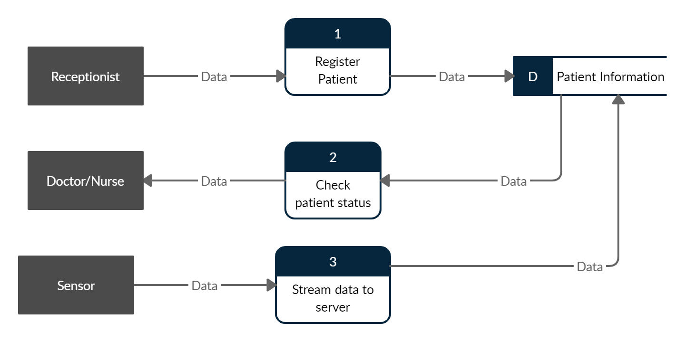
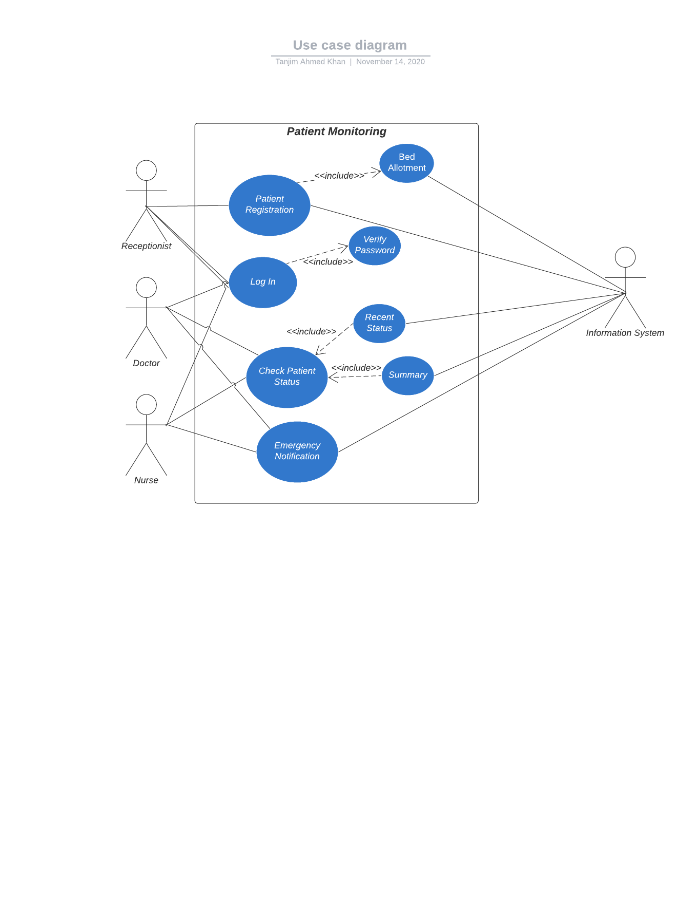

<h1>HackTheVerse Round 1(Health Domain)</h1>


<h2> Hackathon hosted by IIT , University Of Dhaka </h2>

<p>This hackathon aims to Provide communication/analysis generated from data streams in medical systems/sensors 
<p>
<h2>System Architecture Diagrams </h2>
<h5>Activity Diagram</h5>

<br>
<h5>Data Flow Diagram</h5>

<br>
<h5>Use Case Diagram</h5>

<br>
To be very brief , our system is an automation of conducting medical activities online.Like a patient can directly communicate with Doctors/Nurses and take their guidances and keep himself monitored for any amount of time he wants.In case any emergency takes place , doctors/nurses will be notified for further action.Health datas have been streamed using ```Apache Kafka```.

<hr>
<p> <b>Framework: Django 2.0</b><br>
    <b>Database: Sqlite3</b>
    <b>Streaming Server : Apache kafka</b>
</p>
<hr>
<p>
Run this project:<br>
1. Download or clone this repository in your local system<br>
2. In command prompt or terminal, type and run "pip install -r requirements.txt" <br>
3. Install Apache Kafka and start zookeeper server and kafka server
4. After installing necessary libraries, run "python manage.py runserver"
</p>
<p>
<u>If you want administrator access:</u><br>
 user name: Toddlers<br>
 password: srelddot17<br>
</p>
<p>
If you want to log in as doctor/nurse/receptionist, get the username from administrator page and password is 1234
</p>
<hr>
<h2>System Architecture: </h2><br>

<br>
<h3>Team Return Zero Members: </h3>
<h4>1. <a href="https://github.com/NazmulTakbir">Nazmul Takbir</a></h4>
<h4>2. <a href="https://github.com/AfnanCSE98">Sihat Afnan </a></h4>
<h4>3. <a href="https://github.com/1705095">Arif Shariar Rahman </a></h4>
