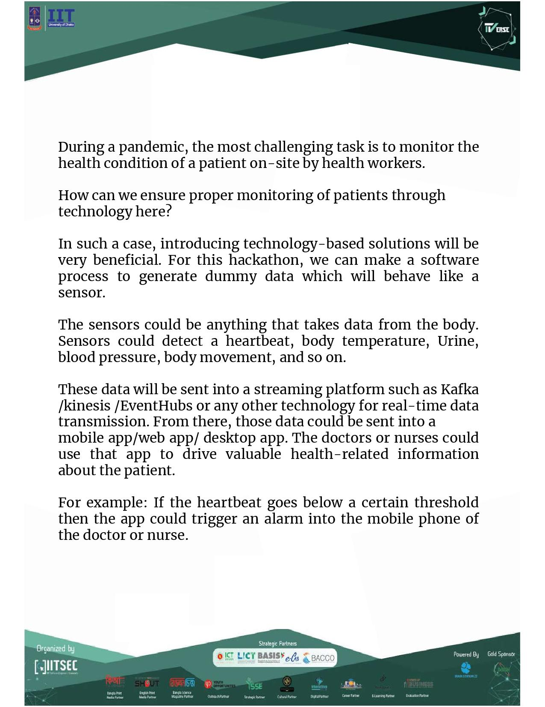
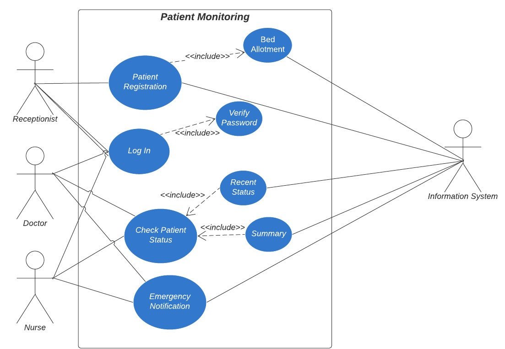
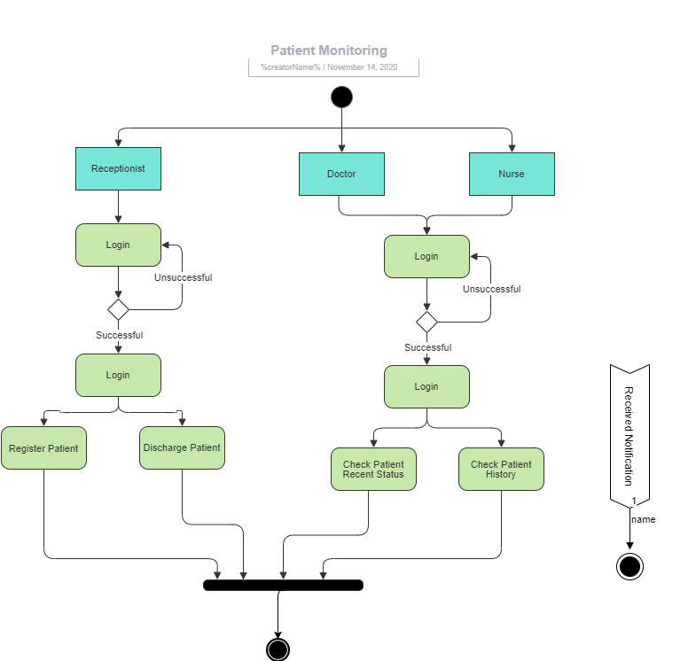
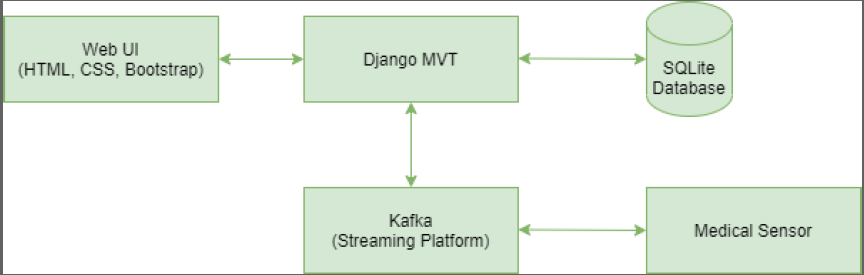

# HackTheVerse - Hackathon hosted by IIT, University Of Dhaka

### Problem Statement 


### Solution Summary
* Download [this](https://github.com/NazmulTakbir/HackNsu2_TEAM_RETURN_ZERO/blob/master/Solution%20Idea%20Summary.pptx) power point presentation

---

### Solution Design Diagrams
* **Use Case Diagram**


* **Activity Diagram**


* **Data Flow Diagram**


* **Architecture Diagram**


### Specifications
```
Framework : Django 2.0
Database : Sqlite3
Streaming Server : Apache kafka
```
### Run this project
* Download or clone this repository in your local system<br>
* In command prompt or terminal, type and run "pip install -r requirements.txt" <br>
* Install Apache Kafka and start zookeeper server and kafka server
    ```
    .\bin\windows\zookeeper-server-start.bat .\config\zookeeper.properties
    .\bin\windows\kafka-server-start.bat .\config\server.properties
    ```
    Then run two python scripts
    ```
    python producer.py
    python beeper.py
    ```
* After installing necessary libraries, run ```python manage.py runserver``` and go to the URL ```http://127.0.0.1:8000/fetchdata/``` to start the consumer thread of kafka
* To access Django Admin
    ```
    username: Toddlers
    password: srelddot17
    ```
* If you want to log in as doctor/nurse/receptionist, get the username from Django admin interface and password is 1234

### Team Toddlers Members:
* [Nazmul Takbir](https://github.com/NazmulTakbir)
* [Sihat Afnan](https://github.com/AfnanCSE98)
* [Tanjim Ahmed Khan](https://github.com/tanjim17)
* [Jayanta Sadhu](https://github.com/Jayanta47)
    
